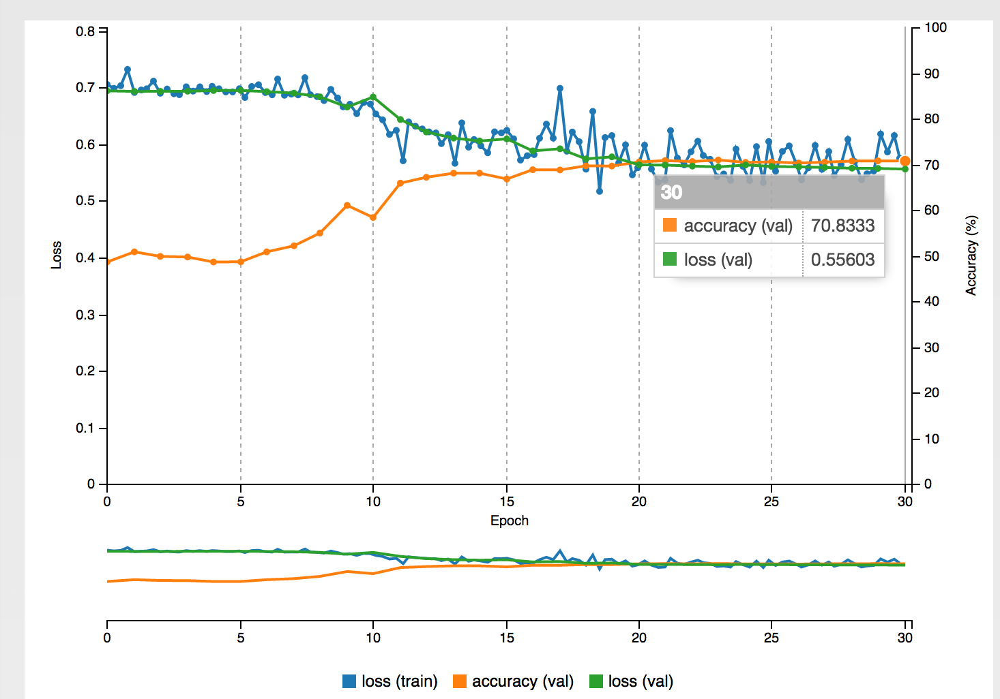
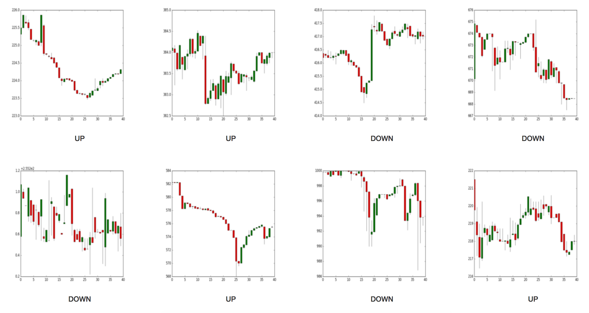

# When Bitcoin meets Artificial Intelligence
[]()

Exploiting Bitcoin prices patterns with Deep Learning. Like OpenAI, we train our models on raw pixel data. Exactly how an experienced human would see the curves and takes an action.

<p align="center">
  
</p>

So far, we achieved:

- [x] Download Bitcoin tick data
- [x] Convert to 5-minute data
- [x] Convert to Open High Low Close representation
- [x] Train a simple AlexNet on 20,000 samples: accuracy is 70% for predicting if asset will go UP or DOWN. Training is done on [NVIDIA DIGITS](https://github.com/nvidia/digits) and with the Caffe framework.
- [x] Quantify how much the price will go UP or DOWN. Because the price can go UP by epsilon percent 99% of the time, and pulls back by 50%
- [ ] Train on **1,000,000+** samples (at least)
- [ ] Apply more complex Conv Nets (at least Google LeNet)
- [ ] Integrate bar volumes on the generated OHLC (Open, High, Low, Close) image
- [ ] Use CNN attention to know what's important for which image. Maybe only a fraction of the image matters for the prediction

## Results on 20,000 samples (small dataset)

<p align="center">
  
  <br><i>Training on 5 minute price data (Coinbase USD)</i>
</p>

<hr/>

<p align="center">
  
  <br><i>Some examples of the training set</i>
</p>

<hr/>

## Illustration of the dataset from CoinbaseUSD

```
                     price_open  price_high  price_low  price_close      volume  close_price_returns close_price_returns_bins  close_price_returns_labels
DateTime_UTC                                                                                                                                             
2017-05-29 11:55:00     2158.86     2160.06    2155.78      2156.00   21.034283             0.000000          (-0.334, 0.015]                           5
2017-05-29 12:00:00     2155.98     2170.88    2155.79      2158.53   47.772555             0.117347           (0.015, 0.364]                           6
2017-05-29 12:05:00     2158.49     2158.79    2141.12      2141.92  122.332090            -0.769505        (-1.0322, -0.683]                           3
2017-05-29 12:10:00     2141.87     2165.90    2141.86      2162.44   87.253402             0.958019          (0.713, 1.0623]                           8
```
- Scroll right to see all the columns!
- Volumes are displayed in BTC.
- Returns are in percentage and are computed on the close prices.

## How to get started?
```
git clone https://github.com/philipperemy/deep-learning-bitcoin.git
cd deep-learning-bitcoin
./data_download.sh # will download it to /tmp/
python3 data_generator.py /tmp/btc-trading-patterns/ /tmp/coinbaseUSD.csv 1 # 1 means we want to use quantiles on returns. 0 would mean we are interested if the bitcoin goes UP or DOWN only.
```

If you are interested into building a huge dataset (coinbase.csv contains around 18M rows), it's preferrable to run the program in background mode:

```
nohup python3 -u data_generator.py /tmp/btc-trading-patterns/ /tmp/coinbaseUSD.csv 1 > /tmp/btc.out 2>&1 &
tail -f /tmp/btc.out
```

If you ever see this error:

```
_tkinter.TclError: no display name and no $DISPLAY environment variable
```

Please refer to this solution: https://stackoverflow.com/questions/37604289/tkinter-tclerror-no-display-name-and-no-display-environment-variable

## Run with Docker

To build the docker image just execute

```
docker build -t dlb .
```

from the repository folder and then run the container

```
docker run -it --name dlb -v $PWD:/app dlb /bin/bash
```

the current folder will be mounted into `/app`. To verify the correct mount
execute inside the container

```
root@c11ef702a6d6:/app# mount| grep app
/dev/sda2 on /app type ext4 (rw,relatime,errors=remount-ro,data=ordered)
```
